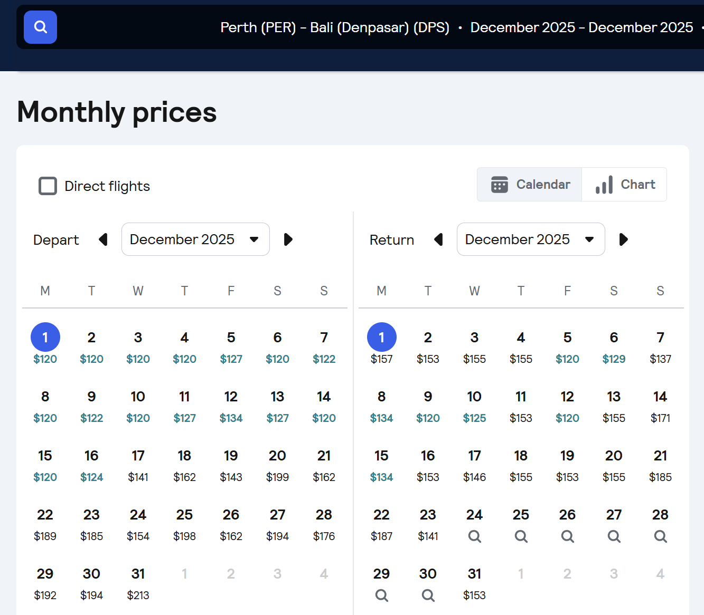
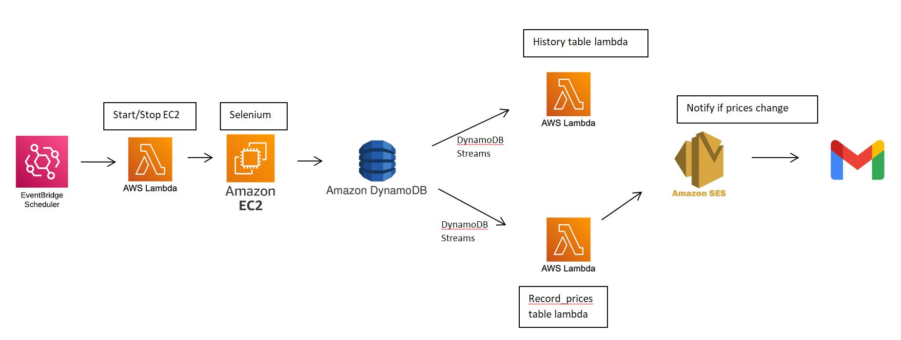

# Skyscanner price alert system built on AWS

I use skyscanner. I think it's a great travel search engine.

But one downside I realised was that in order to get price alerts, you had to pick EXACT dates. Eg. if I was planning on visiting Bali in December, I'd have to subscribe to price alerts for Xth December departure and Yst December return. However, I often found myself in situations where I didn't need to travel on exact dates but rough dates(eg. mid December and return late December) and my priority would be getting the cheapest flights.

As a result, what I would do is search for the whole month

and refresh this page on a regular basis.

But then I thought - why not automate this task and get notified via email when prices reach a record low?

And thus this project was born.

This automated system runs on AWS with these steps:

-  EventBridge Scheduler to run START_EC2 lambda function everyday at 9pm. This function starts up an EC2 t2 micro instance.
-  On EC2 startup, a selenium python script is run using cron job @reboot. The script scrapes flight prices and inserts into DynamoDB.
-  EventBridge Scheduler to run STOP_EC2 lambda function everyday at 9:10pm to stop the server as I don't need it running all the time(reduce costs).
-  DynamoDB Streams react to changes in tables and trigger respective lambdas.
-  Lambdas execute logic to compare todays snapshot vs record low prices and send email if record is broken(eg. todays snapshot for 17th December is $136 compared to the record low so far for 17th December which was $150)
-  I get notified via SES and decide whether I buy the ticket or keep waiting.

